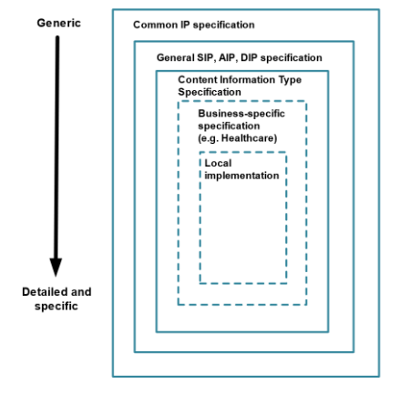
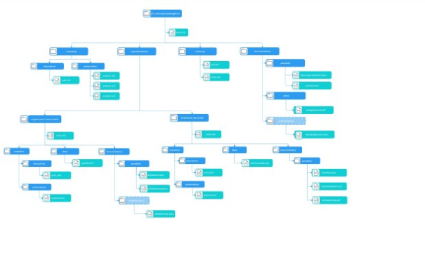

== Introduction

=== Purpose

The purpose of this document is to describe the Content Information Type Specification for 3D Heritage Model data (CITS 3DHM). The specification is designed to be used for the transfer to archives as well as for records exchange between different organisations and repositories. This specification is supported by METS profiles for the Root and Representation METS files, an example package and a Guideline document.

=== Scope

Use of 3D data is widespread across many domains, with a plethora of applications and data formats. This 3DHM content specification limits its scope to the area of 3D models of cultural heritage artefacts, buildings and sites that have been produced as:

* Point cloud models (for example by: photogrammetry, laser scanning, structured light),
* CAD based models (including building information models, BIM and heritage building information models, HBIM),
* Volumetric models (computer tomography),
* GIS models, and
* Procedural modelling (reconstructions).

The scope of the CITS may evolve in future to accommodate other production technologies. The CITS 3DHM has a related specification for 3D Product Model data, CITS 3DPM which can be found at: https://dilcis.eu/content-types/cits-3d-product-model-data.

=== Types of 3D Models
3D models  used for cultural heritage may be created to document existing arefacts and their status (heritage documentation) or to represent a reconstruction of their assumed status in the past (virtual reconstruction). 3D models may be created using various techniques, producing a variety of model types and file formats. For the models produced with any of the techniques described below, the model quality is measured by its resolution (the minimum distance of two points on the target to be recognized as distinct), accuracy (how close the measurement is to its true value) and precision (how close different measurements of the same target are to each other).

==== 3D Point Cloud data
3D Point Cloud models are realised as masses of digital references  in the 3D space (equivalent to a 2D pixel image), which can be further processed to produce a more solid representation by meshing, i.e. generating a surface reconstruction based on a collection of vertices, edges, and faces (usually triangles), built by interpolation. The mesh defines the shape of a polyhedral object approximating the surface of the real one. Several interpolation methods are available to do this.

Point Cloud models can represent the present or past shape of heritage artefacts with variable fidelity depending on the precision of the capture or creation process. There are several techniques for their acquisition:

==== Photogrammetry
Photogrammetry involves the extraction of three-dimensional measurements from two-dimensional data (such as images). Developments in GPU-based processing have allowed rapid reconstruction of 3D surface meshes from sets of conventional photographs of physical objects or environments. The mesh output from this technique can be enhanced by colour information at vertices ( vertex colour) or by using associated 2D images representing surface colour, mapped to the mesh (texture map).

==== Laser Scanning
Laser Scanning is the process of recording three-dimensional information about real-world objects or environments by rapidly sampling or scanning an object’s surface with lasers. The information is returned as a collection of x, y, z coordinates. Laser scanning devices may use time-of-flight, phase or  triangulation methods and the Point Cloud or the mesh output from this technique may be enhanced by colour information at points/vertices (vertex colour) or with an associated 2D image of the surface, which is mapped onto the mesh (texture map). Scanning results can be influenced by the reflective properties of the surface of the object to be scanned.

==== Structured Light
Structured Light is a method of 3D capture that relies on the distortion of projected light to calculate surface form. A known pattern (often a grid or horizontal lines) of light when projected onto a surface appears distorted from perspectives other than that of the projector and observation of this distortion can be used for geometric reconstruction of the surface shape. The mesh output from this technique may be enhanced by colour information at points/vertices (i.e., vertex colour) or an associated 2D image representing surface colour, which is mapped to the mesh (texture map).

The three methods produce substantially similar 3D models. The choice of one of them depends on the object to be scanned, on its position (e.g. for the roof of a building laser scanning can be difficult) and on the availability of the capture device. Using any of the above techniques there may exist parts of the object to be scanned which are not visible, e.g. undercuts. These have to be completed by hand drawing.

==== CAD-based modelling
In Computer Aided Design (CAD) modelling, 3D models are built using 3D CAD systems by defining vertices, edges and faces. Curves may further be defined with various methods, e.g. as splines. The model may also incorporate information about the corresponding parts of the object. In the specialied case of construction design, the technique takes the name of BIM (Building Information Modelling) where additional information is organized according to the IFC (Industry Foundation Classes) standard. If this standard is extended to include information that is relevant for cultural heritage the approach takes the name of HBIM (Heritage BIM).

==== Volumetric modelling
Volumetric 3D models are obtained as the result of a volumetric data acquisition based on layers, i.e. slices of the object automatically assembled to build the 3D model. A typical technique is Computed Tomography (CT), borrowed from medicine, sometimes used to explore the interior of objects. CT directly produces a 3D model of the object including its interior.

==== GIS 3D modelling
The Geophysical Information System (GIS) modelling technique is used to generate the environment in which a heritage asset is placed. It uses the same techniques used in GIS to generate land surfaces. It is used to study the relationship of a monument with its geographical position (e.g. a castle in relation to its position) or the mutual relationship of different assets (e.g. a system of sighting towers).

==== Procedural Modelling
Procedural Modelling produces models generated by the application of a mathematical model that generates the model components. It is very rarely used for heritage documentation but may be used for reconstructions, especially to produce films. It enables the fast production of large models, e.g. a whole town with its inhabitants.

==== 180° Panoramas
180° Panoramas consist of a 180° circular photographs and are typically used for interiors. Although they are not proper 3D models, their use is similar. Relevant parameters are the same as those for photographs.

=== Sources of 3D models
3D models may be created by direct automatic acquisition, CAD, based on measures of the object to be modelled, bibliography and source-based modelling. The latter is a method of model production based on documents, reference photographs, or other sources of information about the present shape of a real-world object or place or about a  past one. They are mainly created as CAD-based models, or  more rarely using other digital design techniques (e.g. 3D sculpture).

=== Data collected or produced during the creation of a 3D model
The 3D model data sets extend beyond that which simply defines the model geometry (the model). Such data can correlate to the model but also to the conditions of the whole production process and to its intended use. This additional data can determine the suitability and quality of the model for its intended use. Such additional data can include: 

==== Metadata
In addition to the metadata requirements of an information package as described in the  common specification (CSIP) and categories of metadata typically found in archival systems (descriptive, structural, administrative, provenance, technical and preservation) there may be additional  metadata requirements for models concerning the tools used for the digitisation, information about the hardware and software used for the acquisition or creation of the model and metadata that forms part of the data model itself (model metadata). Information can also be recorded concerning the resolution, accuracy, and precision of the digitisation process. 
Metadata is by definition structured data which can be serialised by a variety of methods (xml, json, rdf, turtle etc) and defined by a standardised or localised schema.

==== Paradata
Paradata concerns the conditions under which the digitisation or model creation took place (who did it, where, what were the environmental conditions, what was the equipment used), the intended purpose of the model (documentation, research, communication), rationales for decisions taken in the digitisation process leading to the final result, and for reconstructions, references to the documentation supporting the model creation process (images, drawings, reports, archaeological/historical interpretation).

Standards do not exist for the content, structure or semantic description of Paradata although much academic work has been done on describing best practice for its acquisition and recording. Paradata is mainly realised as unstructured text.

==== Geometry information
Geometry information is directly associated with the model and is generated as a result of the creation of the model or from further processing, for example the original point cloud, the meshed object and so on. Geometry information is typically structured data values and specific to a model format.

==== Processing information
Processing information includes information about the processes used to produce any intermediate and the final data model. For example the software used, the interpolation type used for meshing, the standards used (if any) for the production of geometry data and so on. Prcessing information is  typically detailed textual (unstructured) data, but could be encoded to a defined schema.

==== Quality and Authentication information
Quality information can be expressed as estimated resolution, accuracy and precision, and suitability for the models intended purpose. Authentication information can include model validation rules and results (is the model a good representation of the original) and verification quality rules and results (is the model within defined quality rules). Authentication information can also include Digital Signatures that guarantee the quality/authenticity of the model at the time it is archived. Quality and authentication information can be unstructured or structured data and can include recording of events within preservation metadata. More information on Authentication can be found in the CITS 3DPM Guideline at: https://dilcis.eu/content-types/cits-3d-product-model-data.

=== File Formats
3D file formats contain data representing the model type and the necessary information for its display. Use of file formats that offer the best long-term prospects in terms of usability, accessibility, and sustainability is recommended and is generally achieved  with formats that have wide usage, have open specifications, and are independent of specific software or developers. In practice it is not always possible to meet all three criteria above, and a balance has to be found. Open file formats are available, and there may be options to convert proprietary file formats to them; but there is risk which should be assessed for information loss in the transformation. Keeping original, proprietary formats is not ideal, but with the risk of loss of information in transforming file formats, the inclusion of original and format derivations in archival packages is recommended. 

No single format is ideal for preserving 3D data. The choice of preservation file format depends on the format type, the specific features and functions that need preserving (significant properties) and the intended future applications of the model. As with all preservation format transformation decisions, the choice can limit future wide reusability and the planned future users or designated community must be kept in mind.

Recommendations of preferred file formats have been compiled by for example, the Expert Group on Digital Cultural Heritage and Europeanafootnote:[https://digital-strategy.ec.europa.eu/en/library/basic-principles-and-tips-3d-digitisationcultural-heritage], Data Archiving and Networked Services (DANS)footnote:[https://dans.knaw.nl/en/file-formats/] and the UK Data Service (UKDS)footnote:[https://ukdataservice.ac.uk/learning-hub/research-data-management/format-your-data/recommended-formats/]. Preferred formats specific to cultural heritage types of data have been compiled by the Archaeological Data Service (ADS)footnote:[https://archaeologydataservice.ac.uk/help-guidance/guides-to-good-practice/data-analysis-and-visualisation/3d-models/creating-3d-data/file-formats/], with extensive documentation on their use. A summary of preferred formats for 3D data can also be found in the excellent paper on long-term preservation of 3D models by Nicola Amico and Achille Felicettifootnote:[https://archaeologydataservice.ac.uk/help-guidance/guides-to-good-practice/data-analysis-and-visualisation/3d-models/creating-3d-data/file-formats/]. 

Interoperability is key. The European Commission has compiled a comprehensive list of current 3D formats, covering both raster and vector typesfootnote:[https://digital-strategy.ec.europa.eu/en/library/study-quality-3d-digitisation-tangible-cultural-heritage]. This compilation not only serves as a valuable resource but also highlights the concerted efforts of international standardisation bodies, such as the European Committee for Standardization, the International Organization for Standardization (ISO), and the Web 3D Consortium.

=== Layered Data Model

This section introduces the role of the CITS 3DHM and its dependencies on the basic structures of the Information Package.

[example]
This specification is created based on the requirements of the Common Specification for Information Packages (CSIP),  the specification for Submission Information Packages (E-ARK SIP) and the specification for Archival Information Packages (E-ARK AIP). To fully understand its requirements, we highly recommend that users review the requirements and the terminology of the source documents, before using this specification.

The data model structure is based on a layered approach for information package definitions (Figure 2). The Common Specification for Information Packages (CSIP) forms the outermost layer. The general SIP, AIP and DIP specifications add respectively, submission, archiving and dissemination information to the CSIP specification. The third layer of the model represents specific content information type specifications, such as this 3D Heritage Model specification. Additional layers for business-specific specifications and local variant implementations of any specification can be added to suit the needs of the organisation.

.Data Model Structure

Every level in the data model structure inherits metadata entities and elements from the higher levels. In order to increase adoption, a flexible schema has been developed. This will allow for extension points where the schema in each layer can be extended to accommodate additional information on the next specific layer until, finally, the local implementation can add specific entities or metadata elements to satisfy specific local needs. Extension points can be implemented by:

* Embedding foreign extension schemas (in the same way as supported by METS (http://www.loc.gov/standards/mets/) and PREMIS (http://www.loc.gov/standards/premis/) These both support increasing the granularity of existing metadata elements by using more detailed data structures as well as adding new types of metadata.
* Substituting metadata schemas for standards more appropriate for the local implementation.

The structure allows the addition of more detailed requirements for metadata entities, for example, by:

* Increasing the granularity of metadata elements by using more detailed data structures, or
* Adding local controlled vocabularies.

For consistency, design principles are reused between layers as much as possible.

== Specification

=== Requirements Structure
The Content Information Type Specification for 3D Heritage Model data aims to define the necessary elements required to preserve the accessibility and authenticity of 3D Heritage Model data over time and across changing technical environments. The specification elevates the level (and adjusts the cardinality) of some of the requirements set out in the Common Specification (CSIP) and package specifications (namely SIP and AIP) and adds new requirements for the package structure, descriptive metadata, preservation metadata and accompanying METS files. The specification sets out general principles that underpin the specific requirements and further context for the requirements and principles can be found in this accompanying guideline.

=== Principles

==== Principle – data formats and representations
The E-ARK 3D Heritage Model content specification should be data agnostic, i.e. any type of data or data format for 3D models can be packaged for long-term archiving and none is excluded; however the use of open-standards and the inclusion in packages of multiple representations is encouraged to reduce the risk of data format obsolescence and information loss. Where open 3D model data formats exist (e.g. STEP-IFC for BIM) their use alongside original, proprietary data formats is strongly encouraged.

==== Principle - use of PREMIS
From the CSIP and Common Specification for Preservation Metadata (CSPM): 

* PREMIS should be used to record detailed technical metadata,
* Technical information should be included in PREMIS metadata by using extension schemas,
* Information about agents carrying out preservation actions must be recorded in the PREMIS  metadata (this is because METS agents describe agents relevant for generic IP level events such as the creation or submission of the package, not the preservation of the data),
* Event descriptions should be included in PREMIS metadata. Use of the official PREMIS event vocabulary (https://id.loc.gov/vocabulary/preservation/eventType.html) is recommended,
* Detailed Rights information should be included in PREMIS. High-level Rights information in METS indicates restrictions. Detailed, object-specific Rights information should be included in the PREMIS metadata,
* File format information for all files should be included as Persistent Unique Identifier (PUID) values in the appropriate PREMIS semantic units.

Desirable technical and preservation metadata in the context of the 3DHM CITS can include:

* Reference to the content information standard (e.g. STEP-IFC),
* Information about the generating system (Creating Agent software),
* A description of the environment used to render the model.

Event descriptions can include:

* Creation events,
* Conversion or change events,
* Model authentication events.

Detailed technical metadata in the context of the 3D Heritage CITS can include:

* File format, characterisation,  checksums,
* Relationships (is part, contains parts).

Rights information can include:

* Access rights,
* License restrictions,
* Copyright owner,

Use of PREMIS must conform to the requirements of the Common Specification for Preservation Metadata (CSPM). 

=== Use Cases for Archiving of 3D Heritage Model Data

3D Heritage Models are captured or created as representations of physical objects, buildings or sites as so called ‘Digital Twins’ when they are combined with comprehensive contextual informationfootnote:[Niccolucci F, Markhoff B, Theodoridou M et al. The Heritage Digital Twin: a bicycle made for two. The integration of digital methodologies into cultural heritage research (version 1; peer review). Open Research
Europe 2023, 3:64 https://doi.org/10.12688/openreseurope.15496.1]. According to Niccollucci “A digital twin is the digital replica of a real-world object. It includes all the necessary information and is able to simulate - in a digital environment - the characteristics and the behaviour of its real counterpart”. 

The use of 3D in heritage is being driven by needs of conservation, academic research, public access demonstrated by projects such as the European Commission ‘TwinIt’footnote:[https://pro.europeana.eu/page/twin-it-3d-for-europe-s-culture] which states “ Making cultural heritage available for future generations to enjoy and be inspired by is a major public policy goal in the EU. 3D technologies offer unprecedented opportunities to advance this objective, widening access to culture, supporting digital preservation and fostering the reuse of Europe's cultural assets.“ 

Academic work such as by Niccolucci and in the Parthenos reportfootnote:[https://www.academia.edu/120516742/Digital_3D_Objects_in_Art_and_Humanities_challenges_of_creation_interoperability_and_preservation_White_paper "Digital 3D Objects in Arts and Humanities: challenges of creation, interoperability and preservation"] aim to continue work to establish best practice and standards for the creation and long-term preservation of 3D models started by the seminal “London Charter” in 2006footnote:[https://londoncharter.org/].

The use cases for creation of 3D Heritage Models are wide ranging, but the use cases for the archiving of 3D models remain fairly straightforward while serving a wide community:

* To enable long-term archiving of 3D Heritage Model data whilst preserving the usability, authenticity and accessibility of the data over time,
* To enable inter-organisational exchange of 3D Heritage Model data whilst facilitating the understanding of the provenance, context and means to render,
* To enable acceptance of 3D Heritage Model data submission packages (SIPs) at a central repository. 

== Implementation

=== Package Structure 
The CITS 3DHM inherits its package structure from the E-ARK Common Specification for Information Packages and is shown in (Figure 3). It can be seen that additional folders have been added for Paradata, Other and optionally Authentication Documentation at root and Representation level but otherwise the structure is identical. 

.Example Information Package Folder Structure

Multiple formats of the same 3D model which have been created through transformation events may be included in a single package and held in individual Representations (for example proprietary BIM models and STEP-IFC derivations). Information related to a transformation event (software used, parameters etc) should be included in the relevant documentation/paradata folder and details of the event recorded in PREMIS. 

3D models of the same physical object can be created via different means (e.g scanning  vs photogrammetry) and it is a matter for the repository to determine if it considers these models to be the same or a different intellectual entity and thus whether they should be in the same or different information packages. Should models created via different methods be included in the same package then Rights information and Paradata may differ for each model and should therefore be held at Representation level. Submission Agreements between Producer and Archive should detail whether different capture/creation versions of the same physical object are permitted in a single information package.

It is strongly recommended that as much documentation as possible related to the creation, context, provenance and terms of use of the model is included in the information package such as for example: licence terms, project overview, model creation environment and transformation information. The CITS 3DHM recommends the inclusion of such information related to the production of the model in a documentation/paradata sub-folder and related to archiving and use of the model in a documentation/other sub-folder. If model Authentication information (such as data quality rules) is included with the model then this can also be included in the optional documentation/authentication folder. Further information on model Authentication can be found in the CITS 3DPM at: https://dilcis.eu/content-types/cits-3d-product-model-data. The inclusion of a Submission Agreement in the information package is recommended and should be located in the documentation/other sub-folder.

Individual folder structures are recommended within each representation/data folder to provide structure appropriate to the model format used. 

=== Metadata and Supporting Information

==== Descriptive Metadata
The package should contain general Descriptive Metadata about the digitised object and may contain specific Descriptive Metadata about the individual 3D model Representations. According to the CITS Archival Description “Descriptive metadata can be expressed according to many current standards (i.e., MARC, MODS, Dublin Core, TEI Header, EAD, VRA, FGDC, DDI) or a locally produced XML schema”. 

Users may find that existing standards do not provide sufficient elements to adequately describe 3D models. This can be overcome through the use of specialised 3D Model schemas (i.e. CARARE, LIDO) and creation of locally produced, well formed schema as described in the CSIP and CITS Archival Information. The use of standards however is encouraged and greater extensibility can be achieved through use of for example the CIDOC-CRM (Common Resource Model) and extensions. Serialisation methods for metadata are not prescribed in the CSIP but use of METS and PREMIS which are only serialised in XML is mandatory, and hence encoding of additional, descriptive metadata in XML is preferable. Although CIDOC-CRM is primarily encoded in RDF, a schema is available for serialisation in XML.

==== Preservation Metadata
Good practice in the management of 3D Heritage Model data requires that Information Packages include Preservation Metadata, specifically information related to:

* Provenance
* Reference
* Fixity
* Context

According to the CSPM: “When using preservation metadata together with the Common Specification for Information Packages (CSIP) (http://earkcsip.dilcis.eu), it is recommended that these are included in the information package in PREMIS format. Although this is not mandatory, all tools claiming to be able to validate CSIP compliant Information Packages must also be able to validate PREMIS metadata once it exists within the package. The two high-level requirements for the use of PREMIS in Common Specification IPs are that:

* All preservation metadata is created according to official PREMIS guidelines,
* All PREMIS metadata is referenced from the amdSec/digiprovMD element of the appropriate METS file.

It is recommended that users review the CSPM.

CITS 3DHM recommends the inclusion of PREMIS files at Representation level to include  provenance, rendering environment, origination information and if it exists Authentication information.

==== Rights Metadata
Detailed Rights information should be recorded within PREMIS. As such a PREMIS file should be included at either package or in each Representation to contain this. 

==== Paradata
Paradata is defined as supporting textual material which concerns the conditions under which the model digitisation (creation) took place, (who did it, where, what were the environmental conditions), the intended purpose of the model (documentation, research, communication), the reasons of decisions taken in the digitisation process leading to the final result, and for reconstructions, the references to the documentation supporting the reconstruction (images, drawings, reports, archaeological/historical interpretation).

Standards do not exist for the recording of Paradata but considerable work has been done in recommending best practice in the documentation of the process of creation of 3D models. It is hoped that in future standards may be developed for the structuring and semantic description of Paradata that can be used in this CITS.

Within this 3D Heritage Model specification a specific folder for Paradata is defined as a sub-folder of the  Documentation folder at root or Representation level. Within the CITS the concept of Paradata is extended to include any unstructured textual material related to the creation, processing, transformation, rendering or quality or the model(s).

==== Creating, Transforming and Rendering Hardware and Software
Details of the hardware and software used in the creation and transformation and required for the rendering of Heritage 3D Models can be captured in some specialised Descriptive Metadata schemas, described in event based ontologies such as the CRMdig extension of CIDOC-CRM, captured in PREMIS preservation metadata within object (creating application and extensions), environment function (rendering environment), event and agent entity semantic units or can be recorded as simple, unstructured text.

==== Quality Information
Quality information may be included in some specialised metadata schemas or if unstructured can be included in the documentation/paradata folder of each representation.

==== Authentication Information
If Authentication documentation exists then the optional documentation/authentication subfolder can be used at both root and representation level. Authentication events can be recorded within PREMIS and examples are given in the CITS 3DPM specification and guideline as to how this can be done (see https://dilcis.eu/content-types/cits-3d-product-model-data).

==== Processing Information
Processing information unless specifically encoded according to specialised schemas or ontologies can be included in the documentation/paradata sub-folder either at root or Representation level.

==== Geometry Data
Geometry data is closely aligned with the data model itself and should be included in the data folder within each Representation alongside the model data. Specific folder structures can be defined within the data folder for different model types or derivations.

=== Standards

==== METS
The main requirement for METS files in a CSIP Information Package is that they follow the official METS Schema version 1.12 http://www.loc.gov/standards/mets/mets-schemadocs.html (used by CSIP version 2.2) and the extension schema developed for  CSIP and published by the DILCIS Board. As new versions of METS Schema become available the DILCIS Board will evaluate these and, if necessary, update the CSIP.

The METS specification requires a METS profile document which describes the use of METS and the METS elements. All the requirements described in this specification are also expressed with METS profiles for the CITS 3DHM root and representation METS which can be found at: https://github.com/DILCISBoard/CITS-3DHM/tree/rel/v1.0.0.

CSIP specifies that METS files be located at the root of the package folder structure (Root METS) and optionally in each of the Representations within its respective root folder (Representation METS). CITS 3DHM has a requirement to contain at least one Representation and so will contain at minimum a root METS and a Representation METS file. 

==== PREMIS
From the EARK Common Specification for Preservation Metadata:

“When using preservation metadata together with the Common Specification for Information Packages (CSIP) https://dilcis.eu/specifications/common-specification, it is recommended that these are included in the information package in PREMIS format. Although this is not mandatory, all tools claiming to be able to validate CSIP compliant Information Packages must also be able to validate PREMIS metadata once it exists within the package”. The two high-level requirements for the use of PREMIS in Common Specification IPs are that:

* All preservation metadata is created according to official PREMIS guidelines,
* All PREMIS metadata is referenced from the amdSec/digiprovMD element of the appropriate METS file.

Further, to enhance the interoperability of the CSIP and to strengthen the management of information packages (IPs) in an archive, this specification imposes additional requirements regarding the use of PREMIS for describing IPs. The principles adopted in the CSIP for deciding which additional PREMIS semantic units are required are:

* PREMIS should be used to record detailed technical metadata,
* Technical information should be included in PREMIS metadata by using extension schemas,
* Information about agents carrying out preservation actions must be recorded in the PREMIS metadata (this is because the METS agents describe agents relevant for generic IP level events, such as the creation or submission of the package, not the preservation of the data),
* Event descriptions should be included in PREMIS metadata. Use of the official PREMIS event vocabulary https://id.loc.gov/vocabulary/preservation/eventType.html is recommended (note that more elaborate descriptions can be made than are made in this CITS),
* Detailed rights information should be included in PREMIS. High-level rights information in METS indicates restrictions. Detailed, object-specific rights information will be included in the PREMIS metadata,
* File format information for all files should be included as Persistent Unique Identifier (PUID) values in the appropriate PREMIS semantic units.

Desirable technical and preservation metadata in the context of the 3DHM CITS can include:

* Reference to the content information standard (e.g. STEP-IFC),
* Information about the generating system (Creating Agent software),
* A description of the environment used to render the model,
* Model creation, authentication and transformation events,
* Software, hardware, individual and organisational agents,
* Rights statements including: copyright, licenses and access restrictions.

The use of PREMIS within the 3DHM CITS requires that information packages also conform to the CSPM (use of PREMIS is not mandatory within CSIP, but is a SHOULD requirement in CITS 3DHM). If used, the following PREMIS semantic units should be considered:

[cols="1,1"]
|===

|**Characteristic**
|**PREMIS Semantic Unit or Container**
| File format
| object/objectCharacteristics
| File fixity
| object/objectCharacteristics
| Generating software
| object/creatingApplication
| Content information standard
| object/significantProperties
| Rendering environment	
| object/environmentDesignation
| Model creation, authentication or transformation events
| event
| Software, hardware, individual or organisational agents
| agent
| Copyright
| rights/copyrightInformation
| License
| rights/licenseInformation
| Access
| rights/otherRightsInformation
|===

